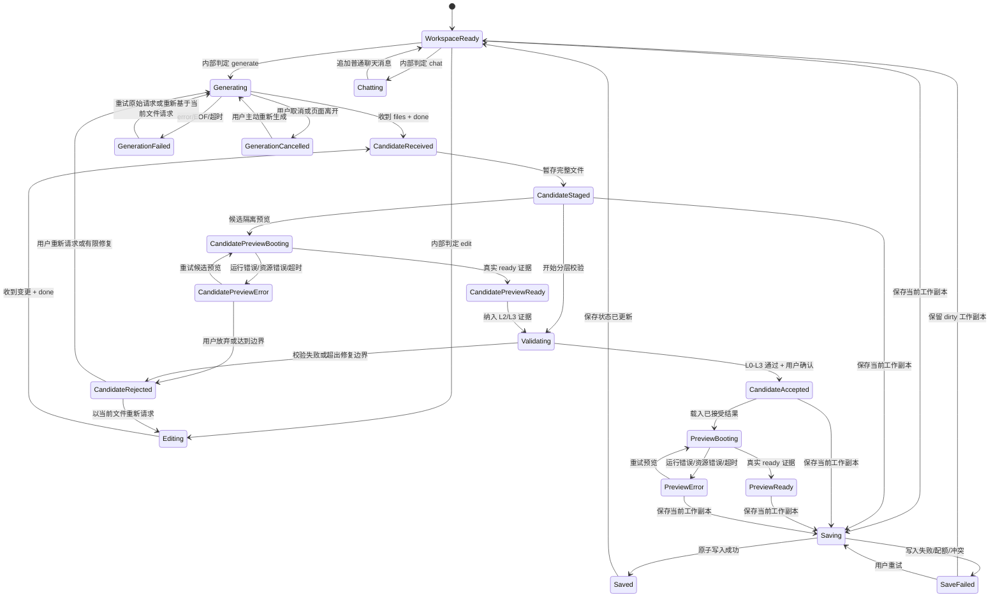

# 04 体验与状态

本文件描述用户看到的入口和状态转换。状态名是产品语义，具体组件、接口和状态管理方式留到执行设计时决定。

## 入口和模式

| 入口 | 默认行为 | 用户应理解的边界 |
| --- | --- | --- |
| 首页预置小说案例 | 直接打开已有案例，不提交访客 prompt | 这是预置成果回放；案例运行数据与项目源码保存语义分开定义 |
| 固化任务看板案例 | 直接打开真实生成后验收固化的独立案例 | 这是一次已经完成的真实生成成果，不是打开入口时重新调用模型 |
| 工作台新项目 | 进入 React 工作台的空白项目主会话；示例案例仍可作为独立入口打开 | 新项目没有旧消息、文件或版本；真实需求由内部操作判定处理，用户不需要选择生成/编辑模式 |
| 已保存项目 | 选择项目并恢复最近保存的工作副本、`Project.messages`、已接受版本和必要运行摘要 | 恢复的是该项目主会话的源码/消息/版本/记录；生成应用内存数据按案例定义处理 |

示例体验、固化案例和真实生成必须有明显的标签。打开示例体验时，不应通过发送一次 hidden prompt 来伪造生成过程。普通界面不提供“首次生成/基于当前代码修改”开关；操作类型只在请求、状态和诊断中保留。

## 项目主会话与内部操作判定（阶段 F1 已实现，代码检查已通过；浏览器现场未完整验证）

一个项目只对应一个主会话，主会话记录复用现有 `Project.messages`。新建项目进入空白消息、文件和版本集合；打开项目恢复该项目已保存的消息、当前编辑文件、已接受版本和必要摘要，然后继续在同一项目中聊天。F1 已实现这些路径，并由 `checkPhaseF1.mjs`、tsc、lint/build 检查；真实聊天链路和完整浏览器现场仍未验证。

每次提交由内部规则判定操作类型，用户不需要切换模式：

- 空文件 map 的新需求判定为 `generate`，结果先进入候选；
- 有代码且 prompt 明确要求修改时判定为 `edit`，基线是发送时编辑器的完整快照，包括未保存编辑及稳定 hash；
- 解释、讨论和问答判定为 `chat`，只追加消息，不创建候选或版本；
- 无法判断是否要生成、修改或仅讨论时先请求澄清，不覆盖当前文件。

已有主会话提出“另一个项目”时，先确认创建独立项目主会话。用户可以选择要带入的背景消息或需求摘要；原项目的文件、工作副本、候选和版本不自动进入新项目，也不与新项目的版本身份混用。

完整 `Project.messages` 可以持久化以便重新打开，但 edit 的默认上下文窗口最多取最近 6 条消息。超出窗口的消息不被默认为模型已知；需要旧背景时必须由用户选择或使用明确记录的摘要。界面和请求诊断不能声称拥有完整会话记忆。

## 状态分层

生成与预览的核心关系如下：

图中 `CandidateReceived` 只有在同时收到完整 `files` 和 `done` 后才成立；单独收到 `files` 只能暂存，不能作为完整结果。候选可以在接受前进行隔离预览和验证，候选通过 L0-L3 且用户确认后才成为当前结果；预览 ready 是运行状态的边界。生成、预览和保存分别有自己的状态，任何一个都不能被另一个推断出来。

## 案例和资源状态

案例打开至少需要表达以下状态：

- `case-loading`：案例清单和入口正在读取；
- `case-ready`：文件、必要资源和入口已准备好，可以开始交互；
- `case-asset-error`：某个被引用资源无法解析，显示资源名、原因和重新加载/替代入口；
- `case-error`：案例清单或入口本身无效，保留返回和重试操作。

如果图片加载失败，界面可以显示有含义的占位图，但必须同时保留可诊断的资源错误；仅用占位图遮住 broken request 不算资源交付完成。下载也要独立检查资源，不因浏览器里恰好能访问宿主 `public` 就宣称导出项目完整。

## 生成状态

### 空闲和输入

空闲时说明当前项目和内部可操作状态，不要求用户选择模式。提交时先按当前文件状态和 prompt 判定 `generate`、`edit` 或 `chat`，再冻结需求、附件、项目 ID、当前编辑器快照（包括未保存编辑）和 base hash。只有 `generate`/`edit` 显示生成或修改过程并产生候选；`chat` 只追加消息。输入框不应在请求进行中悄悄切换到另一个项目或基线，歧义请求应停在澄清状态。

### 运行中

阶段事件可以展示分析、架构、视图和组装进度，但“当前步骤”只表示事件/图状态，不代表应用运行。服务端节点、客户端接收间隔和用户总等待时间用不同标签显示。

### 候选已收到

同时收到完整文件和 `done` 后先显示候选摘要、文件数量、基线和校验状态；单独收到 `files` 只能继续等待。当前已接受结果和用户的未保存编辑仍可访问。候选可以在隔离环境预览，预览结果只作为候选证据；接受前始终保持候选身份，不能覆盖当前结果；通过校验后仍必须由用户明确确认应用，才可成为当前结果。`chat` 消息不进入候选生命周期。

### 失败、EOF、超时

失败信息包含失败类别和位置：请求/模型、SSE 协议、代码校验、运行/资源、保存或冲突。EOF 没有 `done` 时不得显示成功。超时要指出当前能确认到的最后节点，并说明客户端接收间隔不等于服务端执行时间。

### 取消

取消后立即停止接收和展示后续事件，保留已经存在的完整结果、当前编辑文件和已接收诊断。界面用“已停止接收生成结果”或等价文案，并说明上游模型调用可能继续到结束；不能写成“模型已终止”。

### 重试

重试原始请求时保留可追溯的原 run ID/输入，但生成新的 run 记录；基于当前文件重新请求时明确使用新的 base。没有请求上下文时，重试按钮应解释无法重试，而不是发送空请求。

## 预览状态

预览至少区分：

| 状态 | 显示 | 允许操作 |
| --- | --- | --- |
| 模板加载中 | “正在加载模板” | 可等待；已有完整结果时仍可查看结果并看到非阻塞提示 |
| 沙盒启动中 | “正在启动预览”及可选诊断 | 可切换代码；超过约定边界后重试或查看错误 |
| 已 ready | “预览可用”或正常内容 | 交互、编辑、刷新、导出 |
| 运行时错误 | 错误摘要、文件/行号（若有） | 重试预览、查看代码、有限修复（若候选允许） |
| 资源错误 | 资源路径和加载原因 | 重试、替换或导出前修复资源 |
| 超时/外部不可用 | 外部运行时不可用及影响 | 重试、查看源码、导出；不把它判为代码失败 |

`initial`、`running` 等底层状态只能作为内部信号的一部分。必须有能证明运行完成或 iframe/沙盒 ready 的实际证据；代码已渲染和 Sandpack 状态推断都不能单独作为 ready。

## 保存、恢复和冲突体验

保存动作应说明“保存当前工作副本”并在 dirty、saving、saved、save-error 中有明确反馈；首版固定为显式手动保存，不做自动保存。保存失败时保留内存中的编辑，不将界面重置到上一次保存内容。恢复前若检测到当前页面有未保存编辑，先给出保留、放弃或另存的选择；读取到较新标签页版本时进入冲突处理，不静默覆盖。

如果系统能检测到存储被清除，应说明“本地存储已被清除”及可使用的导出文件；多数情况下系统只能看到“未找到本地项目”，此时应说明可能原因，不能断言是清站点数据。页面关闭后内存工作副本不存在时，不得承诺仍可恢复。没有外部副本时不能声称存在服务端备份。配额不足时给出清理旧版本或导出的行动建议，且清理前不删除当前工作副本。

## 项目列表与删除（阶段 F2 已实现，代码检查已通过；浏览器现场未完整验证）

项目列表为每个项目提供重命名和删除入口。重命名只改变展示元数据，不改变 `projectId`、主会话消息、工作副本或版本身份。

删除前展示具体范围，并检查未保存编辑、进行中的生成/写入/验证/修复、未接受候选和其他标签页占用；任一条件未解决时阻止删除，或先要求用户完成明确的保存、取消、放弃或关闭占用标签页操作。已完成且不再写入的预览本身不构成删除阻断。删除要在一个可回滚本地事务中清除项目记录、文件、消息、版本、候选、run、验证/恢复记录、资源索引和其他关联记录。事务失败时保留列表项、内存工作副本和错误信息。

当前项目删除成功后清除当前指针并进入空白项目入口。旧标签页的迟到事件或保存必须带删除前的修订/写入者身份，由仓储拒绝已删除身份的写入，不能静默复活项目。首版不要求回收站、云同步或后台恢复服务。

## 版本栏与历史卡片（阶段 F3 已实现，代码检查已通过；浏览器现场未完整验证）

顶部持续显示项目名、已接受版本和保存状态。已接受版本按项目内自动数字序列显示；没有已接受版本时显示“尚无已接受版本”，不显示 v0。内部 revision 可以保留在诊断中，但普通 UI 不把它当作版本号。

版本名和备注可选，用户输入的 `1.0.0` 等文本只作为标签，不改变快照、`versionId`、hash 或排序。聊天卡片要区分历史版本、当前已接受版本和未接受工作副本；手改、格式化或手动保存工作副本不创建已接受版本。

确认恢复 v2 时，直接创建新的恢复版本和工作副本；如果当前最大版本为 v4，新恢复版本为 v5，并记录 `restoredFrom=v2` 等来源元数据，同时保留 v3/v4。恢复版本沿用被选快照内容，不继承或伪造新的运行校验通过证据；恢复后仍需显式手动保存本地项目快照，后续修改仍需生成候选、通过校验并由用户确认应用。标签修改不改变来源和版本身份。

## 固定关键场景

### 场景 A：手改标题后保存重开

用户打开任务看板，手动把看板标题改成自己的标题，保存项目，关闭或刷新，再重新打开。预期恢复当前编辑文件和标题，项目身份及最近已接受版本仍可见。

### 场景 B：基于当前文件增加优先级筛选

用户在场景 A 的工作副本中请求“增加优先级筛选”。请求基线是含手改标题的当前文件；候选通过校验并接受后，标题仍在，优先级筛选可操作，任务列表的原有状态切换不被删除。若发生 base 冲突，先展示冲突，禁止覆盖。

### 场景 C：失败后恢复

让一次生成、预览或校验在可控夹具中失败。用户应看到失败类别和可保留内容，重试或有限修复后能继续；失败候选不能覆盖上一份已接受结果，取消也不能丢掉已保存或未保存的工作副本。

## 键盘和移动端

关键入口、对话/预览/代码切换、保存、重试、取消、冲突选择和导出都必须可用键盘完成；状态提示使用 `role`/焦点/可读文本表达，但具体无障碍库不在本 spec 锁定。

窄屏优先保留入口和状态可见性。对话/预览面板可切换，代码文件树和表格可在自己的区域滚动；操作按钮、错误信息和 dirty/saved 标识不能被固定宽度裁掉。
